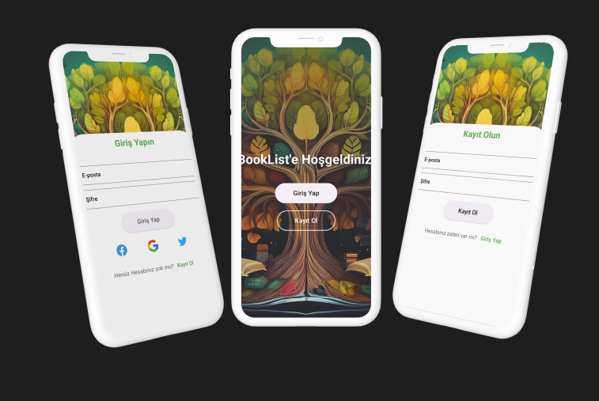

# Login ve SignUp Projesi

Login ve SignUp sayfalarından oluşan Flutter projesi

- [Uygulama Görüntüsü](#uygulama_goruntusu)
- [Kurulum](#kurulum)
- [Proje Dosya Yapısı](#proje-dosya-yapısı)
- [Kullanılan Paketler](#kullanılan-paketler)

<br>

# Uygulama Görüntüsü



<br>

## Kurulum

Bu projeye başlamak için aşağıdaki adımları izleyebilirsiniz:

1. Depoyu klonlayın:
   ```sh
   git clone https://github.com/mehmetakifkucukkaya/register_login_screen-flutter.git
   ```
2. Proje dizinine gidin:
   ```sh
   cd login_signup
   ```
3. Bağımlılıkları yükleyin:
   ```sh
   flutter pub get
   ```
4. Uygulamayı çalıştırın:
   ```sh
   flutter run
   ```
   <br>

## Proje Dosya Yapısı

| Klasör/Dosya    | Açıklama                                        |
| --------------- | ----------------------------------------------- |
| `lib`           | **Ana kaynak kod klasörü**                      |
| │── `core`      | **Uygulamada kullanılan temel bileşenler**      |
| │├── constants  | Uygulamada kullanılan sabit değerler            |
| │└── validators | Form doğrulayıcılarını içeren klasör            |
| └── `pages`     | Sayfaların tasarım kodları                      |
| ├── `widgets`   | Sayfalarda kullanılan özelleştirilmiş widgetlar |

<br>

## Kullanılan Paketler

| Paket Adı    | Açıklama          |
| ------------ | ----------------- |
| `lottie`     | Animasyonlar için |
| `icons_plus` | İcon paketi       |
